# Qt指南
熟练Qt特性，快速开发含GUI的应用程序。
[toc]{level: [2]}
## 为什么使用Qt开发应用程序
Qt 是一个著名的 C++ 应用程序框架。Qt的功能十分强大，即使你没有学过C++的**STL**库，或者没有接触过**XML**等也不用担心，因为Qt已经帮你内置好了各种技术，你只需要会调用即可。Qt 是一个跨平台的开发框架，在各个平台上都具有良好的兼容性。
选择Qt无论是从上手难度和后期维护难度来说，都是非常优秀的。
::: danger ⭕ 警告
即使Qt已经封装好了很多功能，但不可否认的是，学习Qt仍然需要一定的C++基础，以及面向对象编程的思想。还需要对**指针**的相关知识有非常清晰的理解。
:::
## 基本文件构成
### `.pro`文件
`.pro`文件，又称**项目文件**。
项目文件是用来告诉qmake为这个应用程序创建makefile所需要的细节。
简单来说就是对项目的一些基本配置。
+ 添加Qt模块
+ 指定了编译器所要使用的选项和所需要被连接的库
+ 项目使用的模板类型
+ 指定使用的编译器类型
+ 指定文件的位置
+ 指定链接到项目中的库列表
+ ...
### `.h`文件
`.h`文件，又称**头文件**。
头文件是写类的声明（包括类里面的成员和方法的声明）、函数原型、宏定义等。
::: warning ⚠️ 注意
不要在头文件中实现函数与方法。
:::

### `.cpp`文件
`.cpp`文件，又称**C++源文件**。
C++源文件主要实现头文件中声明的函数的具体实现代码。
## Qt程序的实际运行流程
Qt使用C++作为编程语言，C++是一种**面向过程编程**的语言，运行完毕后的代码不可能再次执行，所以Qt使用了一种特殊的运行方式来对应用程序进行管理。
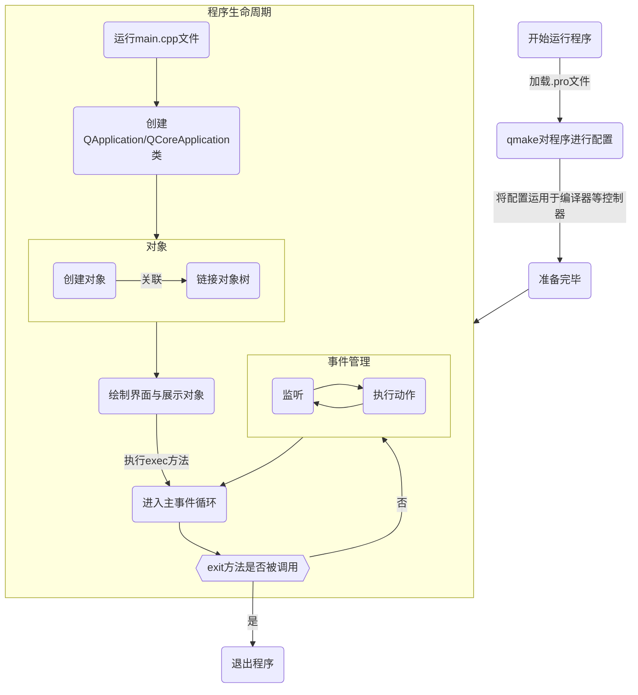
通过上述方法，就可以保证在**主事件**运行前能进行程序的全部配置和对象管理。
## 让对象关联起来——信号槽
信号槽是Qt的核心机制，熟练使用信号槽，可以将程序中的各个对象进行解耦，写出具有优秀维护性的应用程序。
如果一上来就讲一堆定义和概念，读者也许会觉得无聊，我们从一个简单的例子来说起。

读者看过动画片《猫和老鼠》吧，汤姆总是想要抓到杰瑞，但每当杰瑞听到汤姆的动静时，他总能溜走，这是因为：**汤姆通过发出声音，向杰瑞传递了一个信号，这个信号让杰瑞跑了起来**。
不妨让我们用类的方式来描述这两个对象：
``` java
// 抽象猫类😼
abstract class Cat {
    abstract void say();
}

// 抽象鼠类🐭
abstract class Mouse {
    abstract void run();
}
// 汤姆
class Tom extends Cat {
    void say() {
        System.out.println("我汤姆要来抓人啦！");
    }
}

// 杰瑞
class Jerry extends Mouse {
    void run() {
        System.out.println("汤姆来啦，快溜快溜！");
    }
}
```
接下来模拟一下场景：
```java
public class Client {
    public static void main(String[] args) {
        Tom tom = new Tom();
        Jerry jerry = new Jerry();

        // 汤姆发出声音，杰瑞开始跑路
        tom.say();
        jerry.run();
    }
}
```
执行结果
```
我汤姆要来抓人啦！
汤姆来啦，快溜快溜！
```
这个场景比较简单，而且Tom与Jerry之前的关联只是**人为用代码执行顺序的方式**进行了连接，耦合度极强。

我们再看几种稍微复杂的场景:
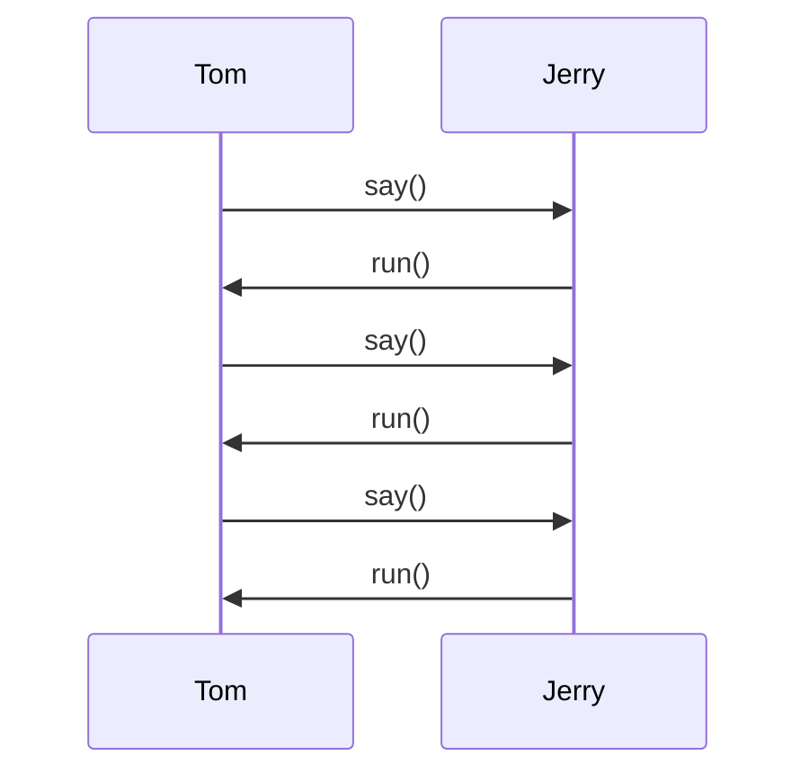
::: tip 场景一

假如Jerry逃跑后又回来偷吃东西。Tom再次发出叫声，Jerry再次逃跑，然后Jerry逃跑后又回来偷吃东西，Tom又发出叫声……如此往复。

我们能否实现只要Tom执行`say`方法，Jerry总能**自动**执行`run`方法?
:::
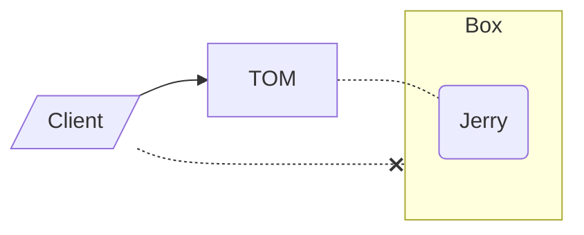
::: tip 场景二
假如Jerry藏在箱子里面。即无法获得Jerry这个对象，无法调用它的方法，

我们能否将Tom与Jerry之间的关系连接起来?
:::
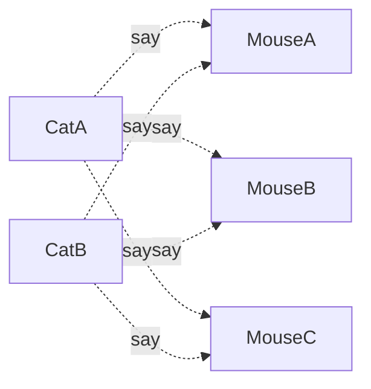
::: tip 场景三
假如有很多只不同种类的猫和很多只不同种类的鼠，当一只猫调用`say`方法，所有的鼠都会调用`run`。

我们能否将多个对象之间建立起联系？
:::

通过上述思考，我们要提供一种对象之间的**通信机制**。这种机制，要能够给两个不同对象中的方法建立映射关系，前者被调用时后者也能被自动调用。
更进一步，即使两个对象都互相不知道对方的存在，仍然可以建立联系。甚至一对一的映射可以扩展到多对多。
使用**场景三**图示中展现的这种简单连接方式，修改代码的数量会非常之多，每当有一个关系需要连接的时候，就要修改一次类内部的代码，非常不利于维护。

如果Cat们事先知道哪些Mouse需要被通知这个信号，那么就只需遍历一次**需要通知的Mouse列表**不就可以了吗？

为了解决这个问题，我们可以采用一种设计模式——**观察者模式**来解决这个问题。
观察者模式（Observer Pattern）也称**发布订阅模式**（Publish）它的定义如下：
::: tip
将对象之间使用一对多的依赖关系，使得当一个对象改变状态，则所有依赖于它的对象都会得到通知（信号）并自动更新。
:::
我们先来解释一下观察者模式的几个角色名称：
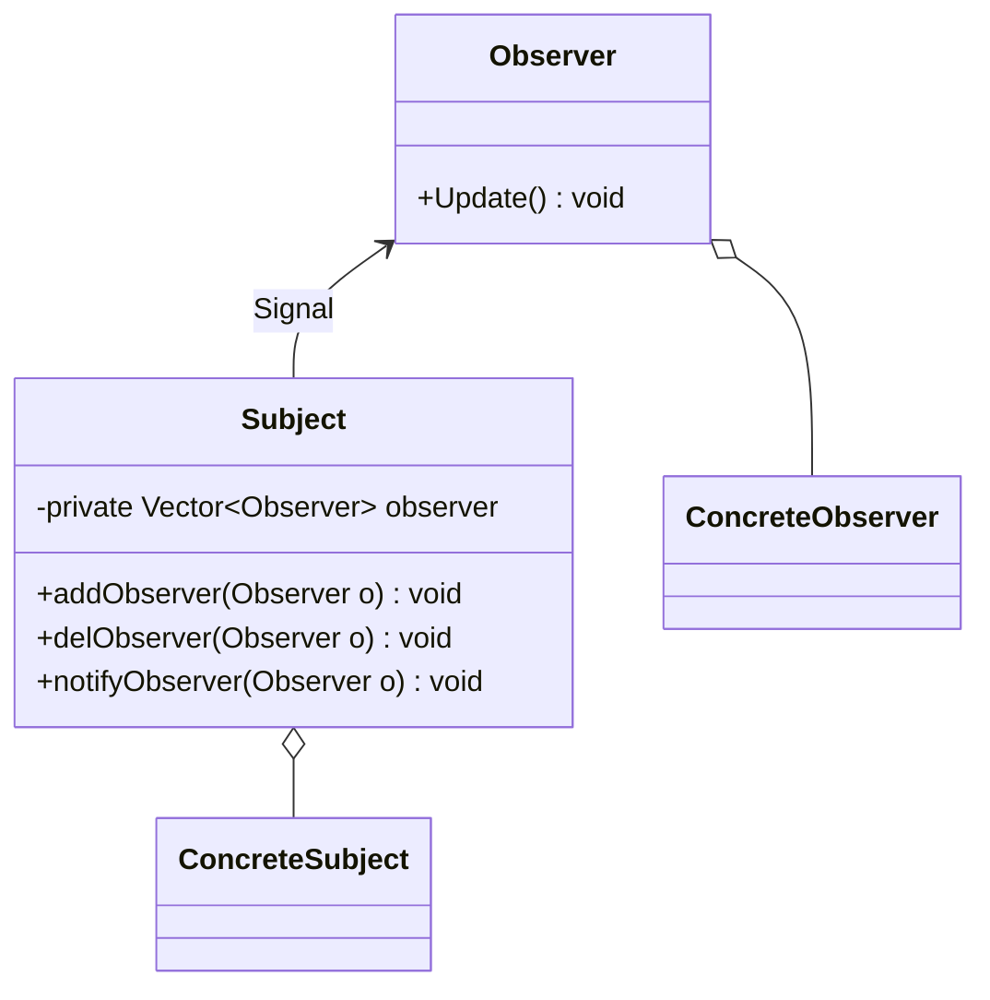

+ Subject（被观察者）
类内部含有**观察者列表**，存储着所有关联被观察者的名单，同时还有增加、删除、和通知的方法。
+ Observer（观察者）
类内部含有**接受消息更新方法**，当被观察者的通知方法被调用时，这个方法会自动执行并更新。
+ ConcreteSubject（具体的被观察者）
定义被观察者自己的业务逻辑，同时定义<u>对哪些事件进行通知</u>
+ ConcreteObserver（具体的观察者）
定义观察者自己的业务逻辑，同时定义<u>接受消息后的处理逻辑</u>。
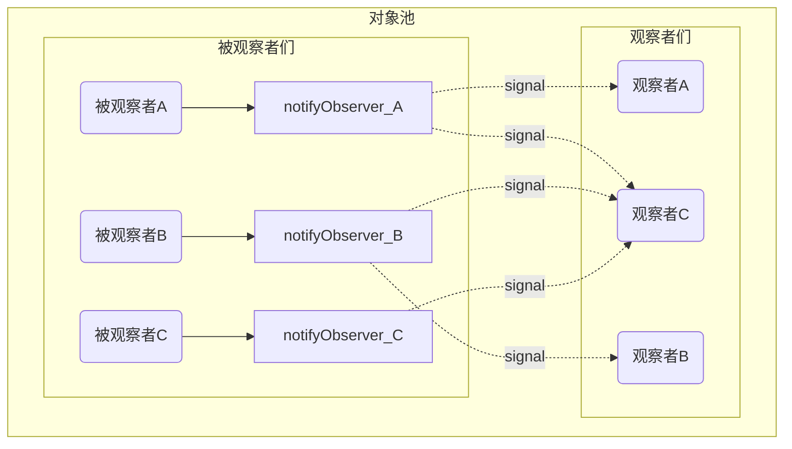
所有的被观察者会将需要连接的观察者放入自己的列表，当自己的`notifyObserver`方法被调用时，就会发出信息，通知所有的观察者执行自己的`Update`方法来更新状态。

通过观察者模式，我们就可以将类与类之间进行解耦，观察者模式也非常符合**单一职责原则**，每个类都尽可能的只管自己的事情，当一方的代码进行修改时，只要不涉及信号发送与信号处理的方法，程序基本不会受到任何影响。
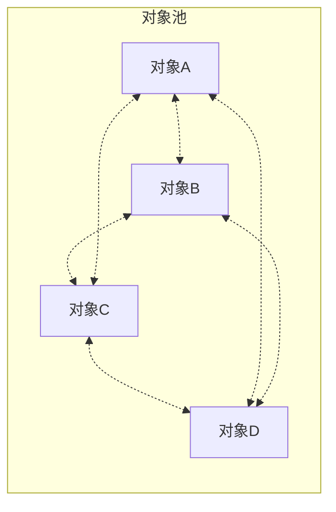
当然这里的观察者与被观察者并不是一个绝对的概念，很多对象既是观察者，又充当被观察的角色，形成相互联动的关联特性。

再回到Qt来说，所谓**信号槽**，实际就是观察者模式的一种实现。


::: warning ⚠️ 注意
Qt的信号槽即使与观察者模式非常类似，但**并不是经典的观察者模式的实现方式**，读者无需了解具体的实现原理，只需要知道如何使用信号槽即可
:::

下面我们先来看看`connect`函数最常用的一般形式：
``` cpp
connect(sender, signal, receiver, slot);
```

connect()函数一般使用四个参数的重载形式，
+ `sender`是发出信号的对象。
+ `signal`是发送对象发出的信号。
+ `receiver`是接收信号的对象。
+ `slot`是接收到信号之后所需要调用的函数。
+ 
当某个事件发生之后，`sender`就会发出一个`signal`（信号）。这种发出是一种广播。如果有`receiver`对这个信号感兴趣，这个对象就会通过`connect`（连接函数），用自己的一个`slot`（槽函数）来处理这个信号。被连接的槽函数会自动被回调。

### 原生信号槽
Qt为每一个Object都预先写好了一些信号与槽函数，可以直接使用他们来进行对象之间的连接。

下面这个例子是在主窗口创建一个按钮，**当用户点击这个按钮时，窗口便会关闭**。
``` cpp
//------------------mainwindow.cpp------------------
#include<qpushbutton.h>
#include "mainwindow.h"
    // 构造函数
MainWindow::MainWindow(QWidget *parent) : QMainWindow(parent) {

    // 创建一个按钮
    // 文本内容是“点击关闭该窗口"， 其父对象是this，即该窗口所指的具体对象
    QPushButton *button = new QPushButton("点击关闭该窗口", this);
    
    // 设置按钮的位置和大小
    button -> move(0, 0);
    button -> resize(200, 100);
    
    //使用connect函数连接
    connect(button, &QPushButton::clicked, this, &QMainWindow::close);
}

MainWindow::~MainWindow() {
}

//------------------main.cpp------------------
#include "mainwindow.h"
#include <QApplication>

int main(int argc, char *argv[]) {

    // 创建QApplication，用来初始化与管理所有对象
    QApplication a(argc, argv);

    // 创建主窗口，并显示
    MainWindow w;
    w.show();

    // 进入主事件循环
    return a.exec();
}

```

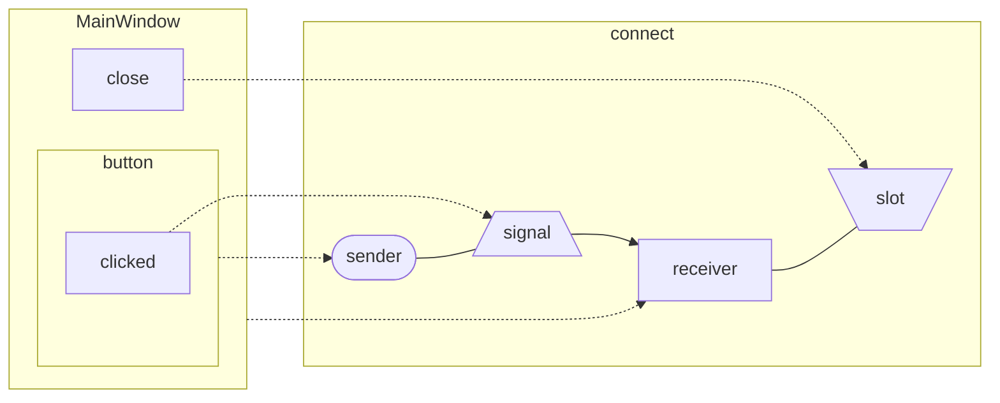

代码中最重要的是`connect`函数，下面就来解释下这几个参数：
+ button：类型是`QPushButton *`，由于发出信号的是按钮，所以`sender`处填入button对象的指针。
+ &QPushButton::clicked：类型是`void *`，clicked是QPushButton类的成员函数，这个函数已经使用`Q_SIGNALS`转化为了信号，所以`signal`处填入button对象的clicked函数的指针。
+ this：实际是该类所指具体的窗口，由于做出动作的对象是窗口，所以`receiver`处填窗口对象的指针。
+ &QMainWindow::close：类型是`bool *`，close是QMainWindow类的成员函数，这个函数已经使用`Q_SLOTS`转化为了信号，所以`slot`处填入窗口对象的close函数的指针。

总结一下，在Qt中让对象之间连接起来，只需要传入以上四个参数即可实现，相比于经典的观察者模式来说，已经很简单了。
### 自定义信号槽
Qt 的信号槽机制不仅仅是使用系统提供的那部分，还会允许我们自己设计自己的信号和槽,用于设计解耦的程序。

继续使用之前提到《猫和老鼠》的例子来作为演示：
``` cpp
//------------------tom.h------------------
class Tom : public QObject {
	Q_OBJECT
	public:
		explicit Tom(QObject *parent = 0);
	signals:
        // 声明一个信号函数
		void say();
};
//------------------tom.cpp------------------
// 无实现

//------------------jerry.h------------------
class Jerry : public QObject {
	Q_OBJECT
	public:
		explicit Jerry(QObject *parent = 0);
	public slots:
        // 声明一个槽函数
		void run();
};

//------------------jerry.cpp------------------
// 槽函数的实现
void Jerry::run() {
	qDebug() << "溜了溜了\n" ;
}
//------------------mainwindow.h------------------
#include "tom.h"
#include "jerry.h"
class MainWindow : public QMainWindow {
	Q_OBJECT
	public:
        // 定义两个对象指针，把Tom和Jerry变成自己的成员
		Tom *tom;
		Jerry *jerry;
		MainWindow(QWidget *parent = 0);
		~MainWindow();
        // 声明一个函数，用来发起信号
		void JerryEatFood();
};

//------------------mainwindow.cpp------------------
#include "mainwindow.h"
#include "tom.h"
#include "jerry.h"
#include <QDebug>
MainWindow::MainWindow(QWidget *parent): QMainWindow(parent) {
    // 创建Tom和Jerry
	this -> tom = new Tom();
	this -> jerry = new Jerry();

    // 使用connect函数连接
	connect(tom, &Tom::say, jerry, &Jerry::run);
	JerryEatFood();
}

void MainWindow::JerryEatFood() {
    // 调用该函数时，发现杰瑞在吃东西，同时Tom发起say的信号
	qDebug() << "发现杰瑞在吃东西！\n";
	emit tom -> say();
}

```
执行结果
```
发现杰瑞在吃东西！
溜了溜了
```
下面我们来分析下自定义信号槽的代码。

对于Jerry和Tom来说，他们继承了QObject，只要继承了QObject了，都需要在头文件中的第一行写上`Q_OBJECT`宏定义。
::: danger ⭕ 警告
即使不添加Q_OBJECT宏定义在一些情况下也是可以运行的，但为了避免任何一个BUG产生的可能，无论是否需要，都不要省略Q_OBJECT。
:::


Tom类新加了一个`signals`。`signals`是用来定义该类的信号。信号本质是一个返回值为void的函数，不能在 cpp 中实现。
Jerry类新加了一个`slots`。`slots`是用来定义该类的槽函数，槽函数本质是一个返回值为void的函数，可以在源文件中实现这个函数。

MainWindow类的`JerryEatFood`比较简单，只有两个语句，第一句是向控制台输出文本，第二个emit tom -> say();是关键。
`emit` 是 Qt 对 C++ 的扩展关键字宏。`emit`的含义就是发出信号，后面只需跟一个对象的信号就可以了，无需关心这个信号是如何广播的。

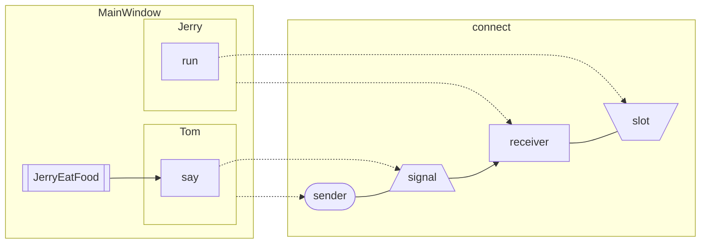


如上图所示，整个程序的执行过程是这样的：首先MainWindow的构造函数先创建两个对象，之后用connect函数连接，最后调用JerryEatFood函数。由于我们的连接，当这个信号发出时，会自动调用Jerry的槽函数，打印出语句。

读者如果细心发现，在自定义信号槽中我们手动执行了`JerryEatFood`函数，而原生信号槽却没有这个行为，这是因为：**原生信号槽已经自动写好了对于窗口的动作，只需用connect函数连接完毕即可**。

我们的示例程序讲解完了。基于 Qt 的信号槽机制，我们不需要观察者的容器，也不需要注册对象，就实现了观察者模式。还是非常方便的。

下面总结一下自定义信号槽需要注意的事项：

1. 发送者和接收者都需要是QObject的子类（Lambda 表达式等无需接收者的时候除外）；
2. 使用`signals`标记信号函数，信号是一个函数声明，返回`void`，不需要实现函数代码；
3. 槽函数是普通的成员函数，作为成员函数，会受到 `public`、`private`、`protected` 的影响；
4. 使用`emit`在恰当的位置发送信号；
5. 使用`connect`函数连接信号和槽。

## 简化信号槽传参——Lambda表达式
Lambda表达式（lambda expression），即**匿名函数**（没有函数名的函数）。
Lambda表达式基于数学中的 $λ$ 演算得名，通过Lambda表达式可以不用创建匿名类就使用匿名方法， Lambda 表达式可以使代码变的更加简洁紧凑。

`C++11` 提供了对Lambda表达式的支持，Lambda 表达式把函数看作对象。Lambda 表达式可以像对象一样使用，比如可以将它们赋给变量和作为参数传递，还可以像函数一样对其求值。

Lambda 表达式具体形式如下:
``` cpp
[capture] (parameters) specifiers -> return_type { body }
```
### `capture` 捕获参数列表

捕获的外部变量列表，通过逗号分隔，可进行传值捕获或者引用捕获
``` cpp
class CppLambda
{
public:
    void Test1(int InValue) {
        int Value = 0;
        auto a1 = [](int x) {/*仅访问外部全局变量*/};
        auto a2 = [Value](int x) {/*值传递局部变量Value*/};
        auto a3 = [this](int x) {/*值传递this指针*/};
        auto a4 = [&Value](int x) {/*引用传递局部变量Value*/};
        auto a5 = [=](int x) {/*值传递所有可访问的外部变量*/};
        auto a6 = [&](int x) {/*引用传递所有可访问的外部变量*/};
        auto a7 = [=, &Value](int x) {/*引用传递局部变量Value，
                                    值传递所有其他可访问的外部变量*/};
        auto a8 = [&, Value](int x) {/*值传递局部变量Value，
                                    引用传递所有其他可访问的外部变量*/};
    }
};
```
### `parameters` 传入参数列表

匿名函数也支持通过外部传入参数，例如：
``` cpp
    int answer = [](int x){ cout << "answer = " << answer;}(100);
``` 
执行结果为
```
answer = 100
```
如果没有需要传入的参数，可以连带`()`一同省略。

### `specifiers` 可选参数
说明符，可选。
值传递捕获的外部变量是在默认情况下是只读的，若想修改该副本，需要在Lambda表达式上添加`mutable`关键字,例如：
```cpp
auto a2 = [Value](int x) mutable {Value++;}；
```
此时执行`Value++;`后，`Value的副本`值就会增加1。
::: warning ⚠️ 注意
此处修改的只是副本，**该变量的值依旧不会改变**，请读者注意。
:::
### `return_type` 匿名函数返回类型
用来指定匿名函数的返回类型，当返回值为 `void`，或函数体中只有一处 `return` （即编译器可以自动推导出返回值类型），这部分可以省略。
### `body` 函数体
匿名函数的执行过程体。

使用Lambda表达式，我们可以修改猫和老鼠的代码：
``` cpp
//------------------jerry.cpp------------------
void Jerry::run() {
    qDebug() << "Jerry跑了\n" ;
}
//------------------mainwindow.cpp------------------
#include "mainwindow.h"
#include "tom.h"
#include "jerry.h"
#include <QDebug>
MainWindow::MainWindow(QWidget *parent)
    : QMainWindow(parent)
{
    this -> tom = new Tom();
    this -> jerry = new Jerry();
	tom->setParent(this);
	jerry->setParent(this);
	connect(tom, &Tom::say, jerry, [=]{
		qDebug() << "Jerry跑了\n" ;
	});
	JerryEatFood();
}

void MainWindow::JerryEatFood() {
    qDebug() << "发现杰瑞在吃东西！";
    emit tom -> say();
}
```
执行结果为
```
发现杰瑞在吃东西！
Jerry跑了
```
``` cpp
// ---------------------------------------------
void Jerry::run() {
    qDebug() << "Jerry跑了\n" ;
}
connect(tom, &Tom::say, jerry, &Jerry::run);
// ---------------------------------------------
                    |
                    |
                    |
                    v
// ---------------------------------------------         
    connect(tom, &Tom::say, jerry, [=]{
		qDebug() << "Jerry跑了\n" ;
	});
// ---------------------------------------------
```
通过使用Lambda表达式，我们将槽函数定义，槽函数引用两个部分的内容使用一句代码就概括了，并且Lambda表达式执行完毕后会自动释放内存，达到**随时随地使用**的效果。

## 更宽泛的对象联动——事件
事件（event）是由系统或 Qt 本身在不同的时刻发出的。
当用户点击鼠标、按下键盘等操作时，或者计时器达到规定时限，都会发出一个相应的事件。
事件的出现，使得程序代码可以按照**事件驱动**的方式来执行。

在本教程一开始的时候便说明了，C++ 以线性的顺序执行代码，这种**顾前不顾后**的程序设计风格显然不适合于处理复杂的用户交互。

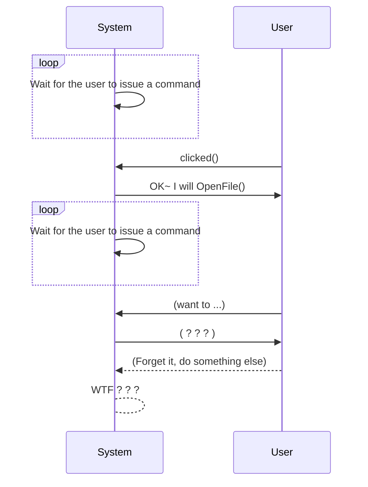

如上图所示，使用程序的人是用户，我们并不清楚用户什么时候会使用某一功能。例如打开文件，我们既不能一直关心用户是否想要打开文件，也不能完全不理睬用户的各种行为。
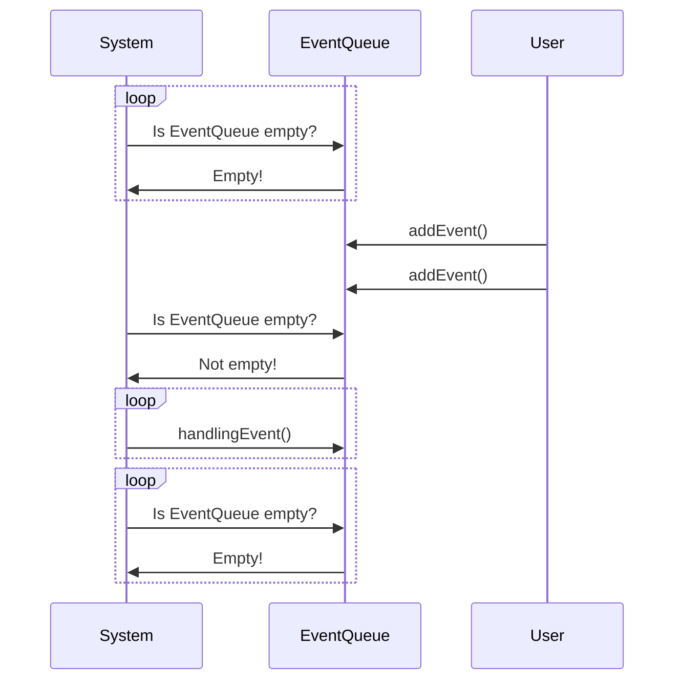
如上图所示，我们可以将事件抽象成为一个**对象**，当某个行为被捕捉到了以后，就把对应的事件加入事件队列，在事件队列的事件会被一次处理，这样，只需要关系**事件队列里是否还有事件未处理**就行了。
没有事件，程序将阻塞在那里，不执行任何代码。
::: tip 提示 💡
上述两个方式，System都会进入循环并一直监听，但对于监听多种事件和只监听事件队列来说，显然后者的复杂性会更低一些，同时效率也会更高。
:::
读者也许会有疑问在 Qt 中，事件与信号槽如此相似，他们有什么区别呢？

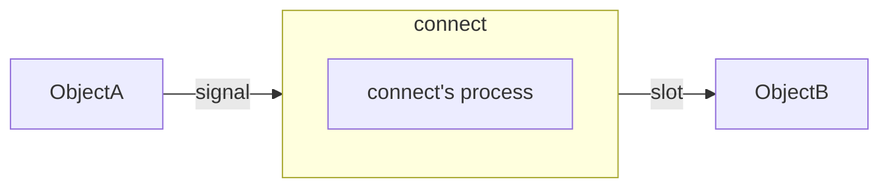
信号由具体的对象发出，然后会马上交给由`connect`连接的对象的槽函数进行处理。使用 Qt 组件的信号槽时，我们并不会把主要精力放在事件上，我们关心更多的是**该对象关联的一个信号**，只关心它的信号怎么发出，发出给谁。

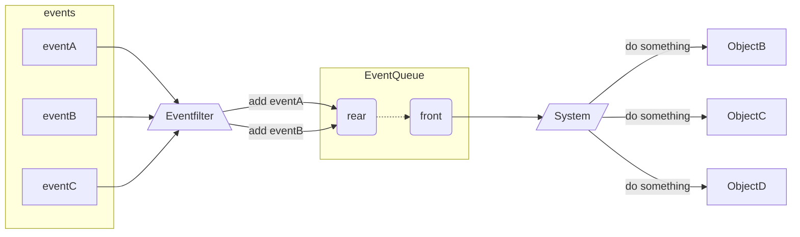

而对于事件，Qt 使用一个事件队列对所有发出的事件进行维护，当新的事件产生时，会被追加到事件队列的尾部。前一个事件完成后，取出后面的事件进行处理。必要时，Qt 的事件**也可以不进入事件队列**，而是**直接处理**。信号一旦发出，对应的槽函数一定会被执行。但是，事件则可以使用**事件过滤器**进行过滤。

在所有组件的父类`QWidget`中，定义了很多事件处理的回调函数：
事件回调函数 |
:-----------:|
|`keyPressEvent()`|
|`keyReleaseEvent()`|
|`mouseDoubleClickEvent()`| 
|`mouseMoveEvent()`| 
|`mousePressEvent()`|
|`mouseReleaseEvent()`|
{.small}

这些函数都是 Protected Virtual 的，也就是说，我们可以在子类中重新实现这些函数。
所以，在Qt中想要使用事件，需要让类继承`QWidget`类及其子类，然后在定义时重写他们的**事件回调函数**即可。

下面来看一个例子：
``` cpp
//------------------EventLabel.cpp------------------
class EventLabel : public QLabel {
	protected:
		void mouseMoveEvent(QMouseEvent *event);
		void mousePressEvent(QMouseEvent *event);
		void mouseReleaseEvent(QMouseEvent *event);
};

void EventLabel::mouseMoveEvent(QMouseEvent *event) {
	this->setText(QString("<center><h1>Move: (%1, %2)</h1></center>")
	              .arg(QString::number(event->x()), QString::number(event->y())));
}

void EventLabel::mousePressEvent(QMouseEvent *event) {
	this->setText(QString("<center><h1>Press: (%1, %2)</h1></center>")
	              .arg(QString::number(event->x()), QString::number(event->y())));
}

void EventLabel::mouseReleaseEvent(QMouseEvent *event) {
	QString msg;
	msg.sprintf("<center><h1>Release: (%d, %d)</h1></center>",
	            event->x(), event->y());
	this->setText(msg);
}
//------------------main.cpp------------------
int main(int argc, char *argv[]) {
	QApplication a(argc, argv);

	EventLabel *label = new EventLabel;
	label->setWindowTitle("MouseEvent Demo");
	label->resize(300, 200);
	label->show();

	return a.exec();
}
```
EventLabel继承了QLabel，重写了`mousePressEvent()`、`mouseMoveEvent()`和`MouseReleaseEvent()`三个函数。我们在鼠标按下（press）、鼠标移动（move）和鼠标释放（release）的时候，把当前鼠标的坐标值显示在这个Label上面。由于QLabel是支持 HTML 代码的，因此我们直接使用了 HTML 代码来格式化文字。通过`event`对象的`x()`和`y()`函数，可以获得坐标值。