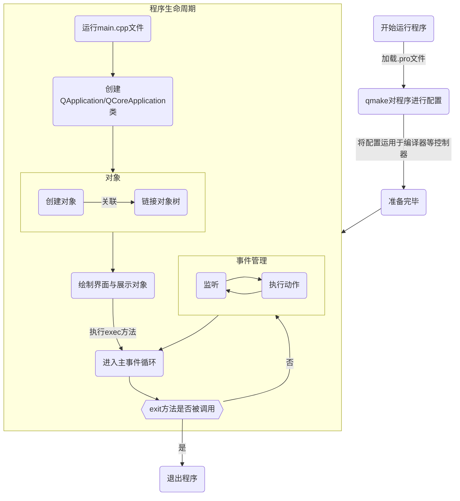
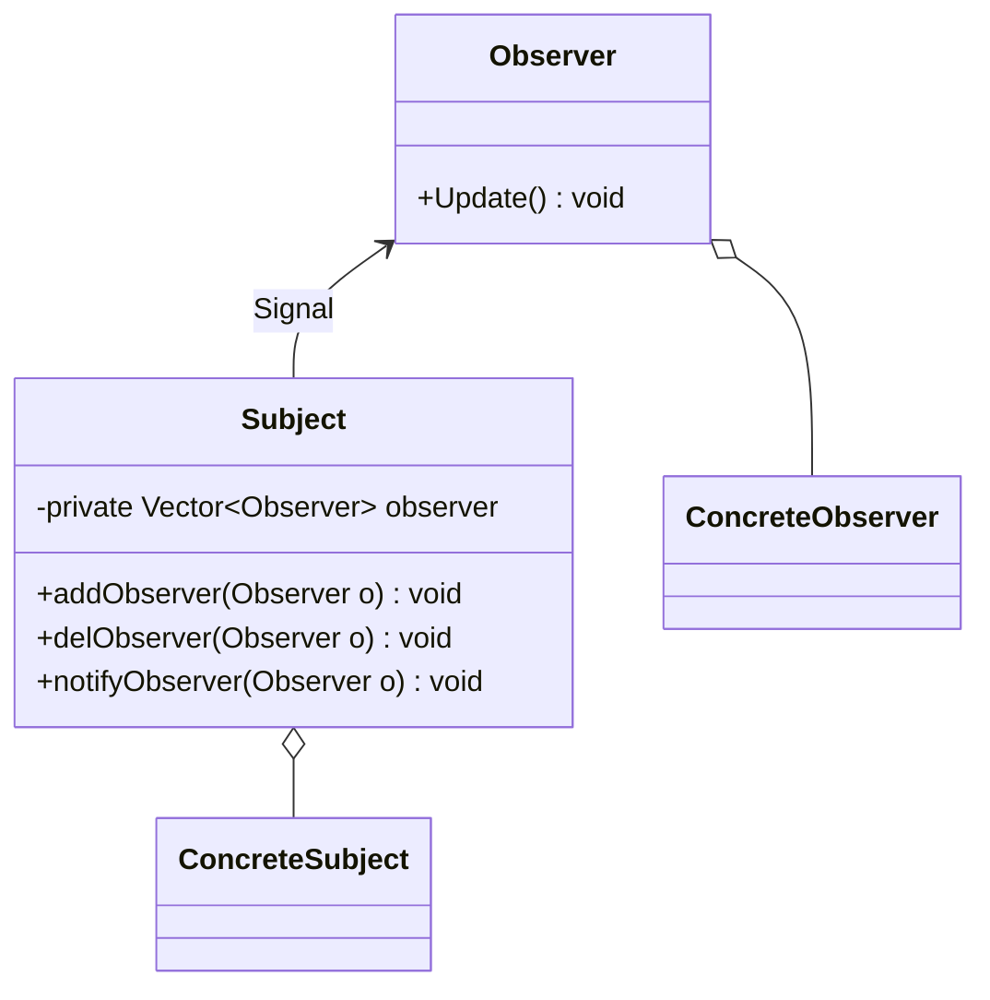
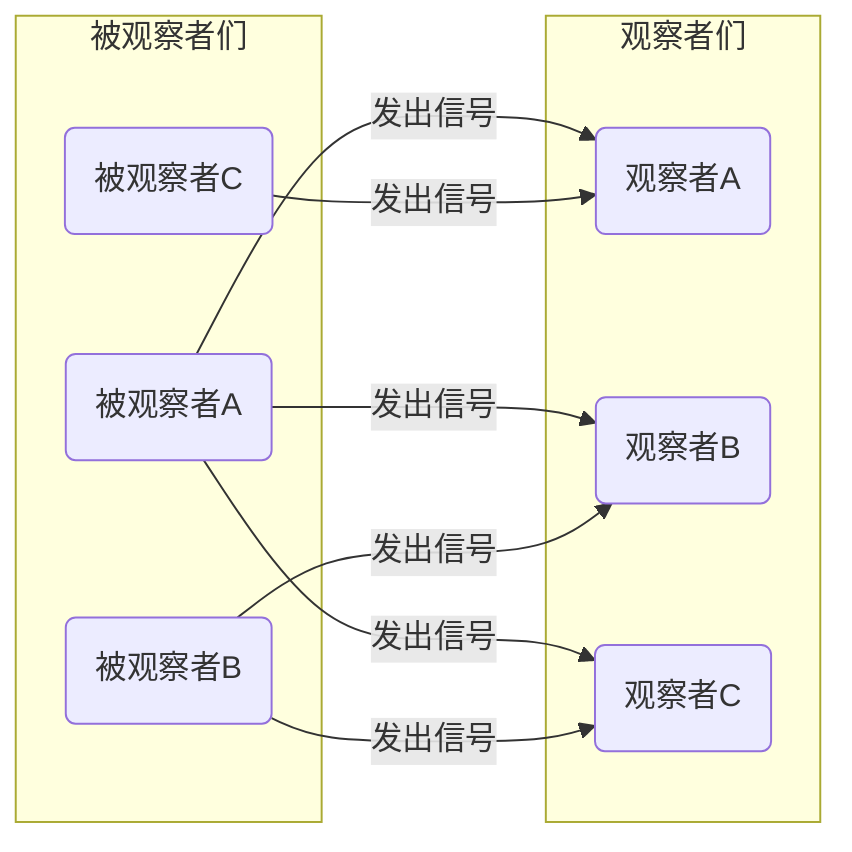
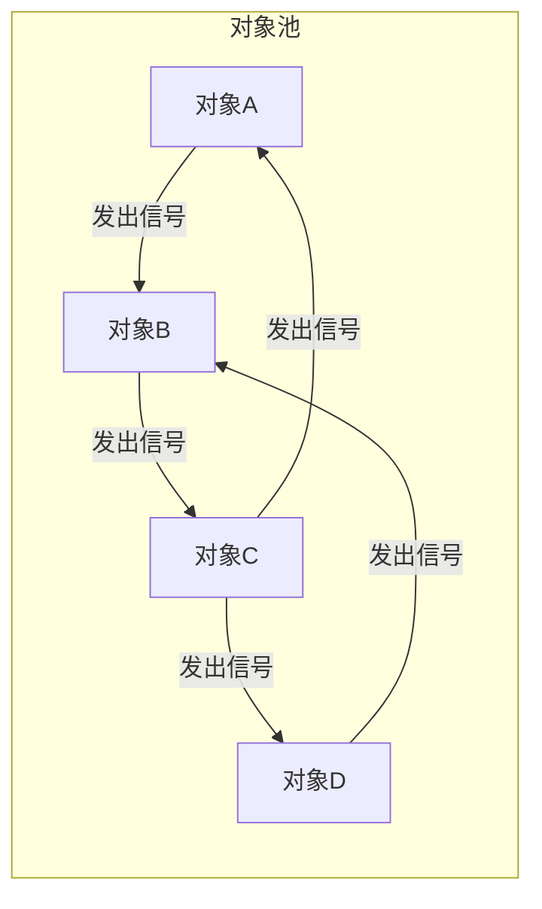

# Qt指南
熟练Qt特性，快速开发含GUI的应用程序。
[toc]{level: [2]}
## 为什么使用Qt开发应用程序
Qt 是一个著名的 C++ 应用程序框架。Qt的功能十分强大，即使你没有学过C++的**STL**库，或者没有接触过**XML**等也不用担心，因为Qt已经帮你内置好了各种技术，你只需要会调用即可。Qt 是一个跨平台的开发框架，在各个平台上都具有良好的兼容性。
选择Qt无论是从上手难度和后期维护难度来说，都是非常优秀的。
::: danger ⭕ 警告
即使Qt已经封装好了很多功能，但不可否认的是，学习Qt仍然需要一定的C++基础，以及面向对象编程的思想。还需要对**指针**的相关知识有非常清晰的理解。
:::
## 基本文件构成
### `.pro`文件
`.pro`文件，又称**项目文件**。
项目文件是用来告诉qmake为这个应用程序创建makefile所需要的细节。
简单来说就是对项目的一些基本配置。
+ 添加Qt模块
+ 指定了编译器所要使用的选项和所需要被连接的库
+ 项目使用的模板类型
+ 指定使用的编译器类型
+ 指定文件的位置
+ 指定链接到项目中的库列表
+ ...
### `.h`文件
`.h`文件，又称**头文件**。
头文件是写类的声明（包括类里面的成员和方法的声明）、函数原型、宏定义等。
::: warning ⚠️ 注意
通常情况下，不要在头文件中实现函数与方法。
:::
**系统路径**头文件
使用`#include < >`来包含头文件。
``` cpp
#include <Headerfilename>
```
**程序相对路径**头文件
使用`#include " "`来包含头文件
``` cpp
#include "Headerfilename"
```

### `.cpp`文件
`.cpp`文件，又称**C++源文件**。
C++源文件主要实现头文件中声明的函数的具体实现代码。
## Qt程序的实际运行流程
Qt使用C++作为编程语言，C++是一种**面向过程编程**的语言，运行完毕后的代码不可能再次执行，所以Qt使用了一种特殊的运行方式来对应用程序进行管理。

通过上述方法，就可以保证在**主事件**运行前能进行程序的全部配置和对象管理。
## 让对象关联起来——信号槽
信号槽是Qt的核心机制，熟练使用信号槽，可以将程序中的各个对象进行解耦，写出具有优秀维护性的应用程序。
在谈论信号槽这个概念之前，先让我们了解一种设计模式——**观察者模式**
观察者模式（Observer Pattern）也称**发布订阅模式**（Publish）

观察者模式定义如下：
::: tip
将对象之间使用一对多的依赖关系，使得当一个对象改变状态，则所有依赖于它的对象都会得到通知（信号）并自动更新。
:::
我们先来解释一下观察者模式的几个角色名称：


+ Subject（被观察者）
类内部含有**观察者列表**，存储着所有关联被观察者的名单，同时还有增加、删除、和通知的方法。
+ Observer（观察者）
类内部含有**接受消息更新方法**，当被观察者的通知方法被调用时，这个方法会自动执行并更新。
+ ConcreteSubject（具体的被观察者）
定义被观察者自己的业务逻辑，同时定义<u>对哪些事件进行通知</u>
+ ConcreteObserver（具体的观察者）
定义观察者自己的业务逻辑，同时定义<u>接受消息后的处理逻辑</u>。

通过观察者模式，我们就可以将类与类之间进行解耦，观察者模式也非常符合**单一职责原则**，每个类都尽可能的只管自己的事情，当一方的代码进行修改时，只要不涉及信号发送与信号处理的方法，程序基本不会受到任何影响。

当然这里的观察者与被观察者并不是一个绝对的概念，在Qt中，有许多的对象既是观察者，又充当被观察的角色，形成相互联动的关联特性。

再回到Qt来说，所谓信号槽，实际就是观察者模式的一种实现。

当某个事件发生之后，它就会发出一个`signal`（信号）。这种发出是一种广播。如果有对象对这个信号感兴趣，它就会通过`connect`（连接函数），用自己的一个`slot`（槽函数）来处理这个信号。被连接的槽函数会自动被回调。

::: warning ⚠️ 注意
Qt的信号槽即使与观察者模式非常类似，但**并不是经典的观察者模式的实现方式**，读者无需了解具体的实现原理，只需要知道如何使用信号槽即可
:::
下面我们先来看看`connect`函数最常用的一般形式：
``` cpp
connect(sender, signal, receiver, slot);
```
connect()函数一般使用四个参数的重载形式，
+ `sender`是发出信号的对象，类型是`const QObject *`
+ `signal`是发送对象发出的信号，类型是`const char *`
+ `receiver`是接收信号的对象，类型是`const QObject *`
+ `slot`是接收到信号之后所需要调用的函数。，类型是`const char *`

## 更宽泛的对象联动——事件
## 
