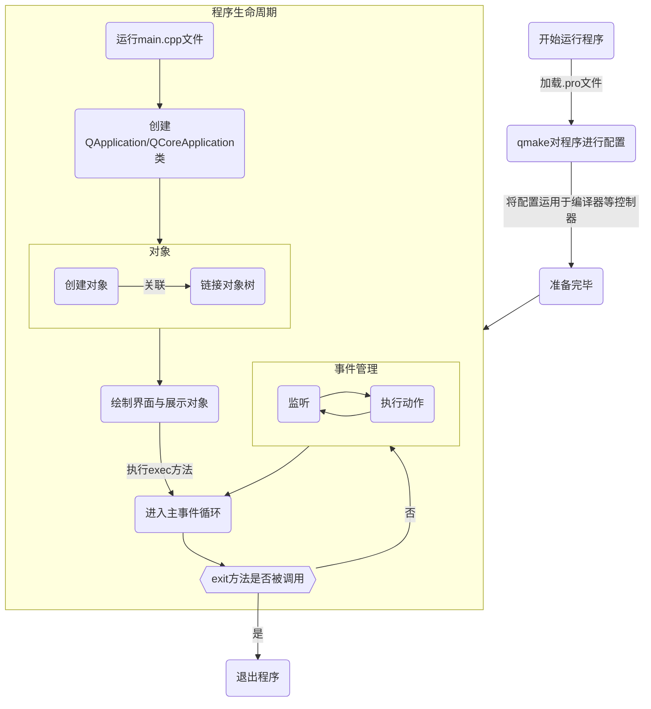

# Qt指南
熟练Qt特性，快速开发含GUI的应用程序。
[toc]{level: [2]}
## 为什么使用Qt开发应用程序
Qt 是一个著名的 C++ 应用程序框架。Qt的功能十分强大，即使你没有学过C++的**STL**库，或者没有接触过**XML**等也不用担心，因为Qt已经帮你内置好了各种技术，你只需要会调用即可。Qt 是一个跨平台的开发框架，在各个平台上都具有良好的兼容性。
选择Qt无论是从上手难度和后期维护难度来说，都是非常优秀的。
::: warning
即使Qt已经封装好了很多功能，但不可否认的是，学习Qt仍然需要一定的C++基础，以及面向对象编程的思想。还需要对**指针**的相关知识有非常清晰的理解。
:::
## 基本文件构成
### `.pro`文件
`.pro`文件，又称**项目文件**。
项目文件是用来告诉qmake为这个应用程序创建makefile所需要的细节。
简单来说就是对项目的一些基本配置。
+ 添加Qt模块
+ 指定了编译器所要使用的选项和所需要被连接的库
+ 项目使用的模板类型
+ 指定使用的编译器类型
+ 指定文件的位置
+ 指定链接到项目中的库列表
+ ...
### `.h`文件
`.h`文件，又称**头文件**。
头文件是写类的声明（包括类里面的成员和方法的声明）、函数原型、宏定义等。
::: tip
通常情况下，不要在头文件中实现函数与方法。
:::
**系统路径**头文件
使用`#include < >`来包含头文件。
``` cpp
#include <Headerfilename>
```
**程序相对路径**头文件
使用`#include " "`来包含头文件
``` cpp
#include "Headerfilename"
```

### `.cpp`文件
`.cpp`文件，又称**C++源文件**。
C++源文件主要实现头文件中声明的函数的具体实现代码。
## Qt程序的实际运行流程
Qt使用C++作为编程语言，C++是一种**面向过程编程**的语言，运行完毕后的代码不可能再次执行，所以Qt使用了一种特殊的运行方式来对应用程序进行管理。

通过上述方法，就可以保证在**主事件**运行前能进行程序的全部配置和对象管理。